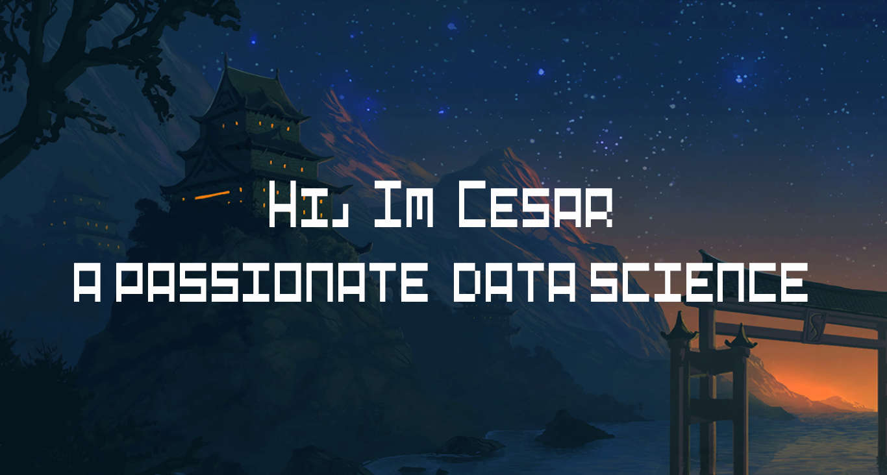

<div align="center">
  
</div>

<h1 align="center">👋 Hi, I'm Cesar Manuel</h1>

<p align="center">
  <strong>Statistical Engineering & Computer Science Student | Data Science Enthusiast</strong>
</p>

<p align="center">
  <a href="mailto:sqcesarmanuel@gmail.com">
    
  </a>
  <a href="https://www.linkedin.com/in/cesarsupo">
    
  </a>
  <a href="https://www.kaggle.com/cesarsupo">
    
  </a>
</p>

---

## 🚀 About Me

```python
class DataScientist:
    def __init__(self):
        self.name = "Cesar Manuel"
        self.role = "Data Science Student"
        self.location = "Peru 🇵🇪"
        self.education = ["Statistical Engineering", "Computer Science"]
        self.interests = ["Machine Learning", "Data Analysis", "MLOps"]
        
    def say_hi(self):
        print("Thanks for dropping by! Let's connect and build something amazing together!")

me = DataScientist()
me.say_hi()
```

- 🎯 Passionate about transforming data into actionable insights
- 🏆 Active hackathon participant with proven track record
- 📊 Experienced in end-to-end Data Science project development
- 🌱 Currently deepening my knowledge in **DevOps** and **Cloud Technologies**
- 💡 Always eager to learn new technologies and best practices

---

## 🛠️ Tech Stack

### Languages
<p>
  
  
  
</p>

### Data Science & ML
<p>
  
  
  
  
  
</p>

### Data Visualization
<p>
  
  
  
</p>

### Databases
<p>
  
  
  
</p>

### Tools & Technologies
<p>
  
  
  
  
  
  
  
</p>

---

## 💼 What I'm Working On
- 🌐 Working on the maintenance of Simiscript, the language learning platform 
- 🔭 Building machine learning models for real-world problems
- 📚 Exploring advanced statistical methods and their applications

---

## 📫 Let's Connect!

I'm always interested in collaborating on data science projects, discussing new ideas, or just having a chat about technology and innovation. Feel free to reach out!

<p align="center">
  <a href="mailto:sqcesarmanuel@gmail.com">
    
  </a>
</p>

---

<div align="center">
  
</div>

<div align="center">
  <i>⭐️ From <a href="https://github.com/cesarmsq">cesarmsq</a> - Let's build something amazing together!</i>
</div>
